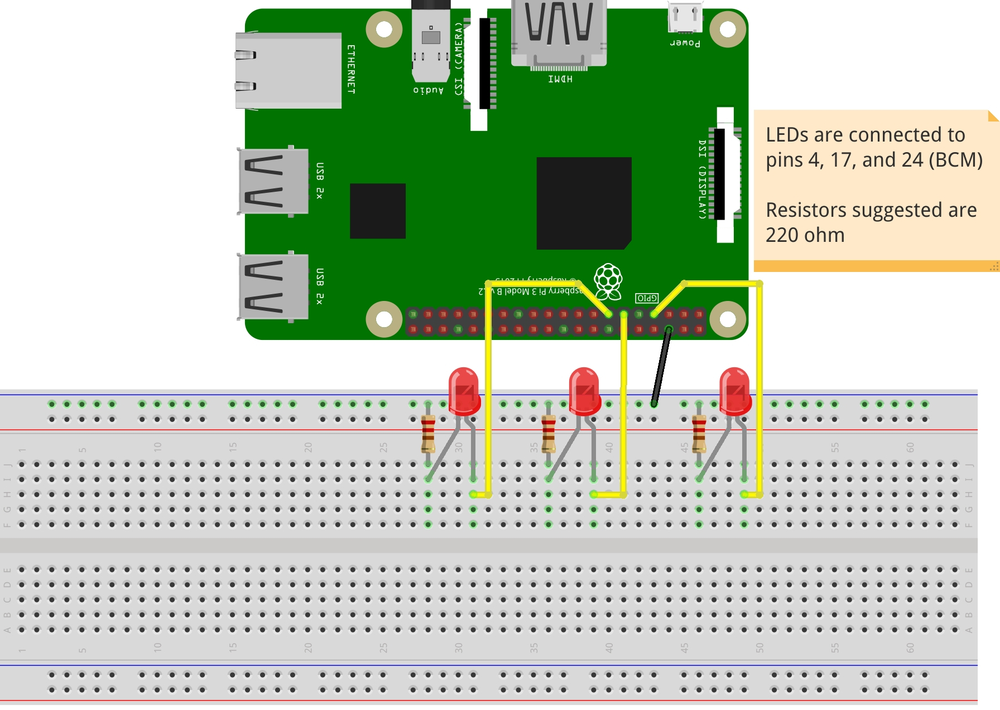

## PD2Python
Requires X-windows for user interaction. If using ssh the -X option is recommended  
Example creates a looped sequence of 3 tones. A toggle is available to start and stop the loop. A slider attached to a metronome is available to change the speed of the loop. Volume slider also is included.
Each of the 3 tones controls the on/off state of 3 gpio outputs (start with some LEDs for example).

### Hookup guide here:

### Video of result is available here:  

