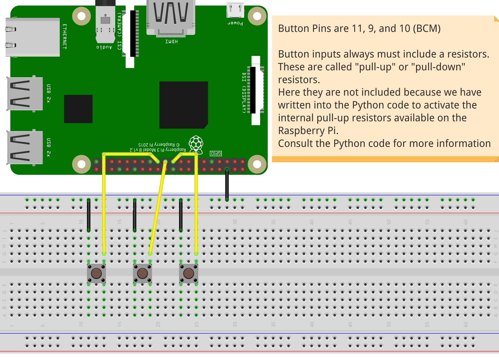

## 3 buttons trigger different tones 
First example using GPIO inputs. 3 momentary switches are connected to pins 11, 9, and 10. Each switch (button) triggers a different MIDI tone, like a keyboard.
Keeping both .pd and .py scripts in the same folder, launch the code with the following command:
```
python send-data.py
```
The Python code will launch the PureData code without graphic interface. If you wish to launch the interface at the same time simply edit the os.system command in the python code, removing the option '-nogui'

### Hookup guide here:

### Video of result is available here: <br />
[](http://www.youtube.com/watch?v=7eejn8HrJ5o "")
