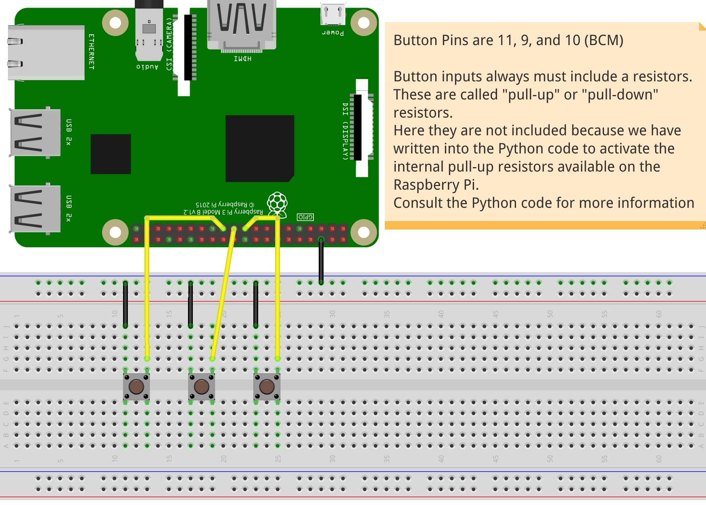

## Buttons to trigger different sequences
The python code is exactly the same as in the first example (button-tones). The major difference here is the PureData code. It is prepared to play sequences of different types of sounds designated to three different buttons.
Prerequisite in PureData for this example specifically is the freeverb external. Find and install by searching freeverb in help --> externals.
If not found try intalling via command line:
```
sudo apt-get install pd-freeverb
```
Keeping all .pd and .py scripts in the same folder, launch the code with the following command:
```
python send-data.py
```
The Python code will launch the PureData code without graphic interface. If you wish to launch the interface at the same time simply edit the os.system command in the python code, removing the option '-nogui'

### Hookup guide here:

### Video of result is available here: <br />
[](http://www.youtube.com/watch?v=WNbXtVwYrAk "")
