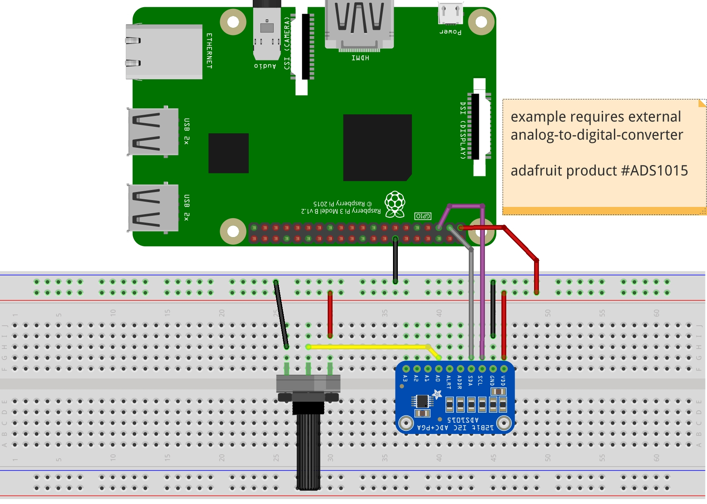

### Potentiometer to send range of values to PureData 
Example requires the adafruit ADS1015. Raspberry Pi does not have inherent capability of reading and converting analog signal to digital (ADC). To achieve analog input on the Raspberry an external device is required to perform this function. An MCP3008 is another chip that can do this. <br />
The ADS1015 uses i2c communication. For this reason we must install i2c-tools for Python. The following command is required:
```
sudo apt-get install python-smbus
```
The file test-adc.py is included for isolated testing of the ADS1015. An external file is also included titled ADS1x15.py 
Keeping both .pd and .py scripts in the same folder, launch the code with the following command:
```
python send-adc.py
```
The Python code will launch the PureData code without graphic interface. If you wish to launch the interface at the same time simply edit the os.system command in the python code, removing the option '-nogui'

### Hookup guide here:

### Video of result is available here: <br />
[](http://www.youtube.com/watch?v=2OOzT_CEHNg "")
# mentions
Thank you to pythonexemplary.com for their [excellent tutorial](http://www.python-exemplary.com/index_en.php?inhalt_links=navigation_en.inc.php&inhalt_mitte=raspi/en/adc.inc.php) for using the ADS1015, as well as other adc devices
